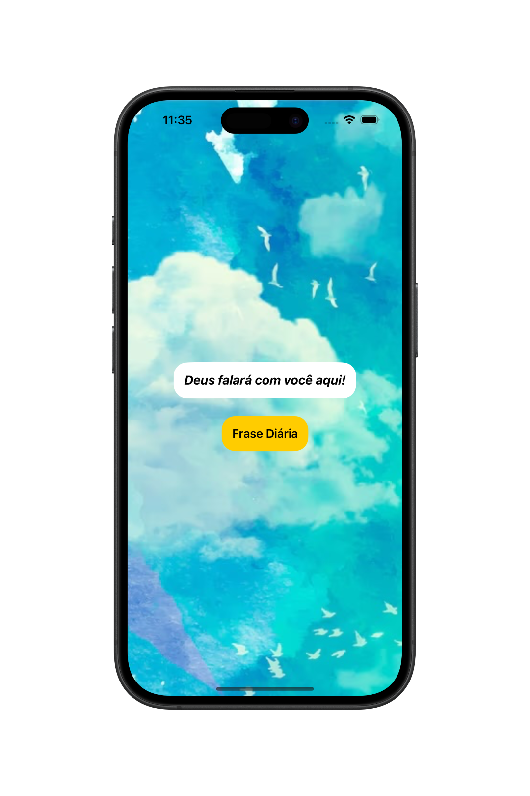
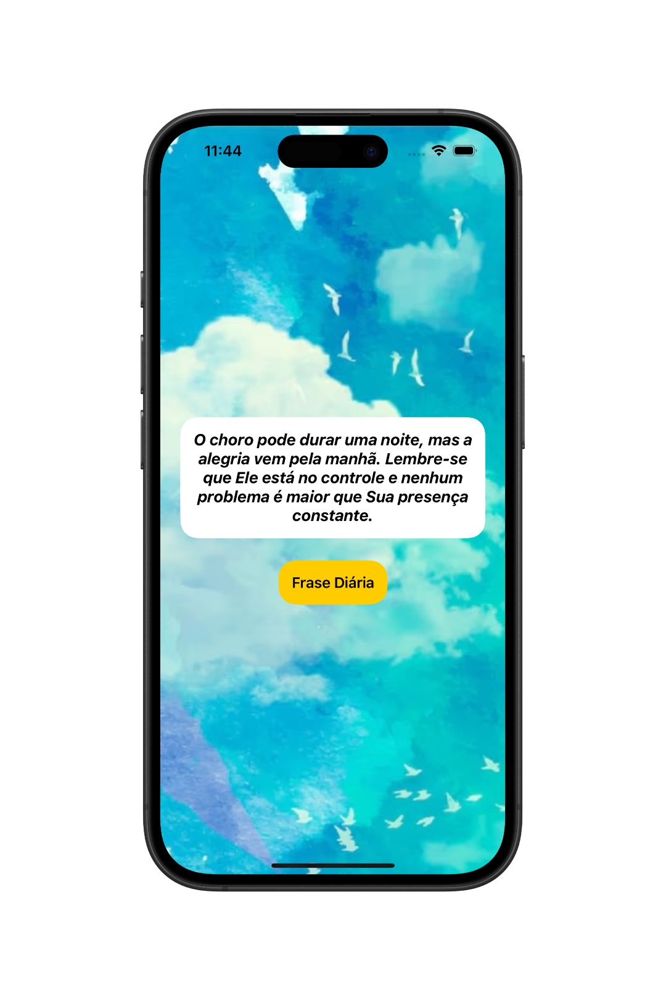
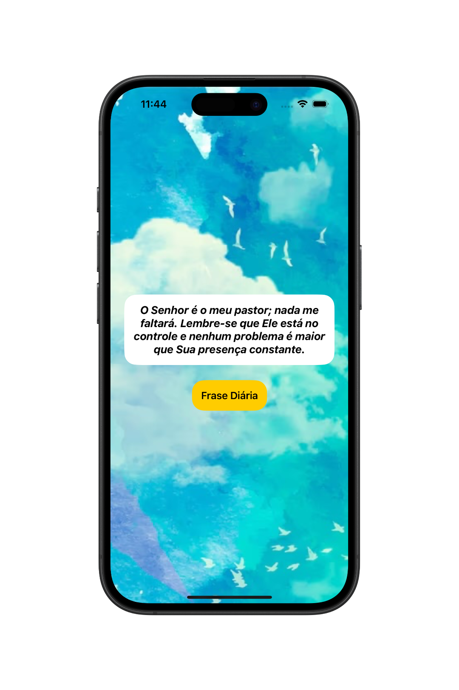
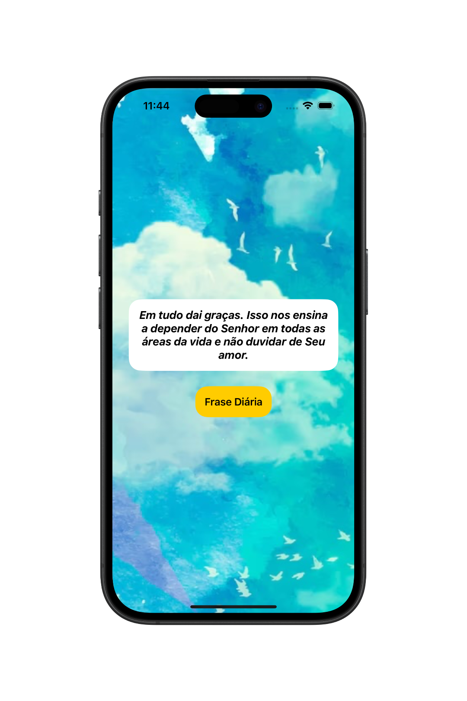

# 📱 Blessed Words - App de Frases de Fé Diária

O **BlessedWords** é um aplicativo simples desenvolvido com **SwiftUI**, que apresenta frases diárias para fortalecer a fé e proporcionar mensagens de paz/esperança. Com um toque, o usuário recebe uma nova mensagem selecionada de maneira aleatória.

  
  
  
  

## 🛠 Tecnologias Utilizadas

- Swift  
- SwiftUI  
- MVC (Model-View-Controller) 
- Mock de Dados (Array de Frases Pré-definidas)
- Gerenciamento de Estado (@State)

## 👨🏻‍💻 Como Usar o Aplicativo

- Baixe o projeto e abra com o Xcode.
- Execute o app em um simulador iOS ou em um dispositivo físico.
- Ao abrir o app, você verá uma mensagem pré-definida.
- Toque no botão **Frase Diária** para receber uma nova mensagem.
- As mensagens são selecionadas aleatoriamente a cada toque.

## 📌 Observações

Este projeto foi criado com fins **educacionais**, como prática de desenvolvimento iOS utilizando **SwiftUI**. As mensagens são exibidas de forma simples e direta através do gerenciamento de estado **@State**, e os dados estão mockados localmente por meio de um array de frases.
